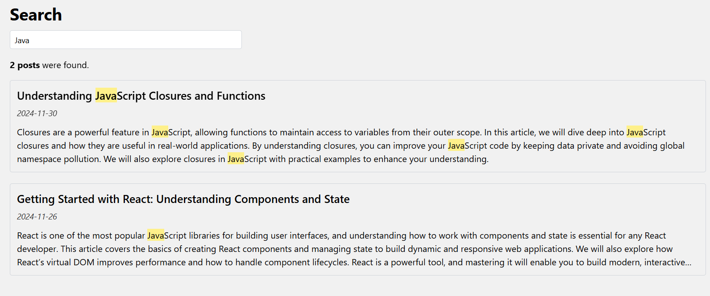

# Sowlutions Interview Task

This project is a task for Sowlutions interview.



## Getting Started

### Prerequisites

Make sure you have the following installed:

- [Node.js](https://nodejs.org/) (version 14 or higher)
- [npm](https://www.npmjs.com/) or [yarn](https://yarnpkg.com/)

### Installation

1. Clone the repository:

   ```sh
   git clone https://github.com/mohamadayash22/sowlutions-task.git
   cd sowlutions-task
   ```

2. Install dependencies:

   ```sh
   npm install
   ```

3. Run the development server

   ```sh
   npm run dev
   ```
